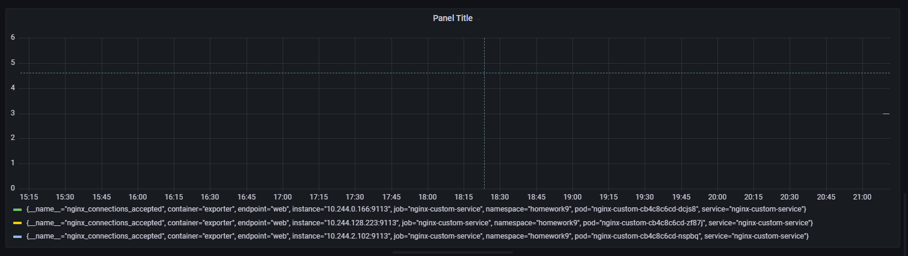

1. Собрал кастомный nginx
2. Выполнил: podman push docker.io/gervladisalv/nginx:v0.0.1
3. Написан deployment-nginx.yaml
4. Написан service-nginx.yaml
5. Написан servicemonitoring-nginx.yaml
6. В web интерфейсе прометеус Status -> Targets появился созданный serviceMonitor
7. График в Grafana 